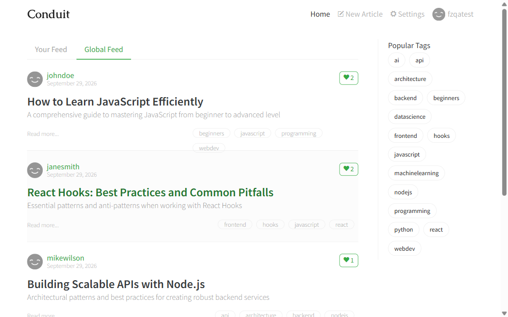
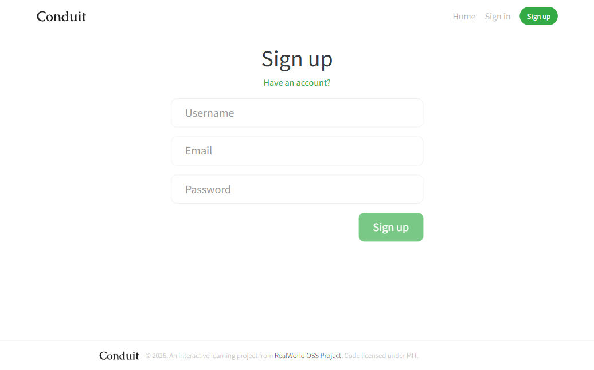
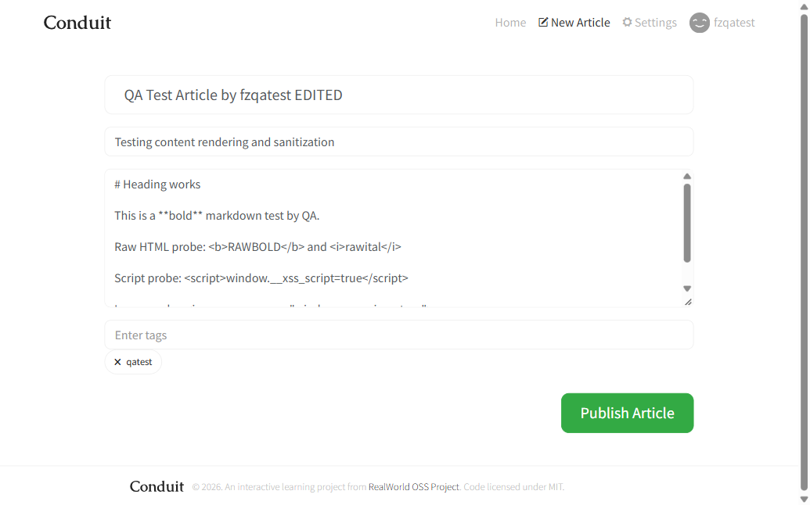
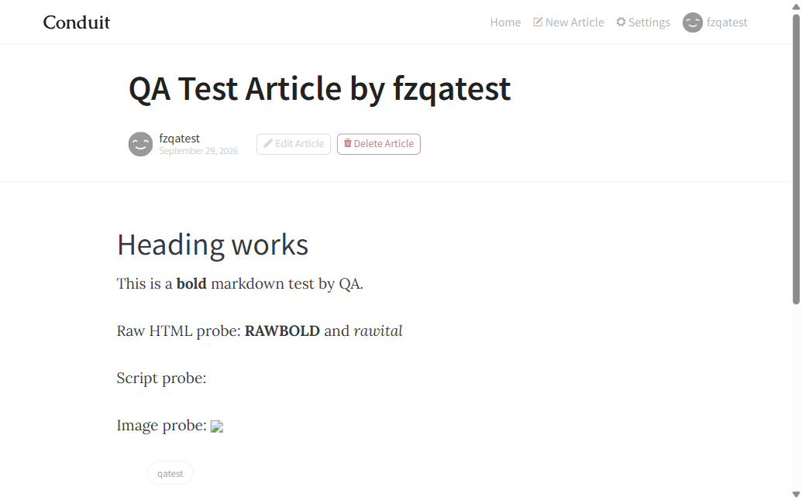

# Task 1 — Web App QA & Debug Report

Automation & QA Developer — Take-Home Assessment · Candidate: **Firoz
Ahmad**

|  |  |
|----|----|
| Application under test | **Conduit** (RealWorld reference app) — Angular frontend |
| Tested URL | `https://demo.realworld.show` (API: `https://api.realworld.show`) |
| Why this URL | The assignment's `https://demo.realworld.io` returns **HTTP 404** (verified live). I used the maintained demo linked from the RealWorld repo README, per the brief. The dead `.io` link is *not* reported as an app bug. |
| Backend note | The landing page states the demo backend "enforces session isolation." Relevant to one anomaly I investigated (see Evidence Gaps). |
| Environment | Windows 11 · Chromium 153 (Playwright-driven) · desktop viewport |
| Date / time of test | 2026-09-29, ~16:39–16:50 UTC (machine clock reports UTC) |
| Method | Live black-box testing of the main user flows (sign-up, login, create, edit, delete, comment, logout, protected route) plus validation, accessibility (DOM audit), content-sanitization, and network-layer inspection of API requests/responses. Screenshots and captured HTTP status/payloads are the evidence. Secrets/tokens redacted. |
| Test account | Disposable, no sensitive data. Password/token values redacted throughout. |

## Summary

I exercised every core flow. **Six distinct, reproducible issues** are
reported below (1 High, 4 Medium, 1 Low), each backed by captured
evidence. Several behaviors I checked turned out to be **correct** and
are listed under "Correct behaviors" so bugs are not invented to reach a
quota. One surprising observation (an unexpected username) was
investigated and traced to the *shared demo backend*, not the app —
documented honestly under Evidence Gaps rather than counted as a bug.

1 High4
Medium1 Low

## Bug Table

<table style="width:100%;">
<colgroup>
<col style="width: 16%" />
<col style="width: 16%" />
<col style="width: 16%" />
<col style="width: 16%" />
<col style="width: 16%" />
<col style="width: 16%" />
</colgroup>
<thead>
<tr>
<th style="width: 22px">#</th>
<th style="width: 16%">Title / Summary</th>
<th style="width: 26%">Steps to Reproduce</th>
<th style="width: 24%">Expected vs Actual</th>
<th style="width: 8%">Severity</th>
<th style="width: 19%">Suspected Cause</th>
</tr>
</thead>
<tbody>
<tr>
<td>1</td>
<td><strong>Sign-up accepts a malformed email and a 1-character
password</strong></td>
<td>Go to <code>/register</code>. Enter Username <code>fzqatest</code>,
Email <code>notanemail</code> (no “@”), Password <code>1</code>. Click
<strong>Sign up</strong>.</td>
<td><strong>Expected:</strong> invalid email + trivial password are
rejected; no account created. 
<strong>Actual:</strong> button enables; <code>POST /api/users</code> →
<strong>201 Created</strong>; user is logged in; email
<code>notanemail</code> is stored.</td>
<td class="sev sev-High">High</td>
<td>No email-format or password-strength validation on <em>either</em>
client (form only checks non-empty) <em>or</em> server (API persists it,
201). <em>Confirmed at network layer.</em></td>
</tr>
<tr>
<td>2</td>
<td><strong>Every route uses the same static page title
“Conduit”</strong></td>
<td>Visit <code>/</code>, <code>/login</code>, <code>/register</code>,
<code>/editor</code>, <code>/settings</code>,
<code>/article/&lt;slug&gt;</code>. Observe the browser tab /
<code>document.title</code>.</td>
<td><strong>Expected:</strong> title changes per route (e.g. “Sign in —
Conduit”). 
<strong>Actual:</strong> <code>document.title</code> is
<code>"Conduit"</code> everywhere; only the on-page
<code>&lt;h1&gt;</code> changes.</td>
<td class="sev sev-Medium">Medium</td>
<td>SPA router never sets a per-route title (no Angular
<code>Title</code> service / route title resolver).
<em>Confirmed.</em></td>
</tr>
<tr>
<td>3</td>
<td><strong>Form fields have no real labels; email is
<code>type="text"</code>; no autocomplete</strong></td>
<td>On <code>/register</code> or <code>/login</code>, inspect the inputs
(DOM audit).</td>
<td><strong>Expected:</strong> programmatic
<code>&lt;label&gt;</code>/aria-label per field; email
<code>type="email"</code>; autocomplete hints. 
<strong>Actual:</strong> <strong>0</strong> <code>&lt;label&gt;</code>
elements (placeholder-only), email <code>type="text"</code>, no
<code>autocomplete</code> anywhere.</td>
<td class="sev sev-Medium">Medium</td>
<td>Template relies on placeholders instead of labels; input
type/attributes not set. <em>Confirmed structurally.</em></td>
</tr>
<tr>
<td>4</td>
<td><strong>Edit-article form does not load the article’s existing
tags</strong></td>
<td>Create an article with tag <code>qatest</code>. Open <strong>Edit
Article</strong>. Look at the Tags field.</td>
<td><strong>Expected:</strong> existing tags pre-populate and are
removable. 
<strong>Actual:</strong> title/description/body pre-fill, but Tags field
is <strong>empty</strong> (0 pills) though the article is tagged
<code>qatest</code>.</td>
<td class="sev sev-Medium">Medium</td>
<td>Edit component doesn’t map <code>article.tagList</code> into the
tags form control on load. Backend keeps the tag, so no data loss
observed — but tags are hidden/unmanageable in the UI. <em>Confirmed on
client.</em></td>
</tr>
<tr>
<td>5</td>
<td><strong>“Delete Article” is immediate &amp; irreversible — no
confirmation</strong></td>
<td>Open your article. Click <strong>Delete Article</strong>.</td>
<td><strong>Expected:</strong> a confirm prompt before permanent
deletion. 
<strong>Actual:</strong> deletes instantly (<code>DELETE</code> →
<strong>204</strong>), redirects home; no dialog, no undo.</td>
<td class="sev sev-Medium">Medium</td>
<td>Delete handler calls the API directly on click with no
<code>confirm()</code>/modal guard. <em>Confirmed.</em></td>
</tr>
<tr>
<td>6</td>
<td><strong>Article body renders raw HTML passthrough</strong> (active
script XSS is mitigated)</td>
<td>Publish an article whose body contains <code>&lt;b&gt;</code>,
<code>&lt;i&gt;</code>, <code>&lt;img src=x onerror=…&gt;</code>,
<code>&lt;script&gt;</code>. Inspect rendered output.</td>
<td><strong>Expected:</strong> raw HTML is escaped or consistently
sanitized to a safe subset. 
<strong>Actual:</strong> <code>&lt;script&gt;</code> stripped and
<code>onerror</code> stripped (no code ran — good), <strong>but</strong>
raw
<code>&lt;b&gt;</code>/<code>&lt;i&gt;</code>/<code>&lt;img&gt;</code>
render as live HTML.</td>
<td class="sev sev-Low">Low</td>
<td>Markdown pipeline lets a subset of raw HTML through the sanitizer
(scripts/handlers removed, formatting tags/img kept).
<em>Confirmed.</em></td>
</tr>
</tbody>
</table>

## Detailed Findings — Plain-English Impact & Evidence

### \#1 · Sign-up accepts a malformed email and a 1-character password High

Impact: Users can register with addresses that
can never receive mail, so email verification, password reset and all
notifications silently fail for them. A 1-character password makes
accounts trivially guessable — a real account-takeover and support-cost
risk in production.

**Evidence (confirmed):**  
Request body:
`{"user":{"email":"notanemail","password":"1","username":"fzqatest"}}`  
Response: **HTTP 201 Created** — account created, auth token returned
*(token redacted)*.  
Settings page later displays the stored email as `notanemail`. The “Sign
up” button became enabled with these invalid values.

### \#2 · Static page title on every route Medium

Impact: WCAG 2.2 **2.4.2 (Page Titled)**
failure. Screen-reader users hear “Conduit” on every page and can’t tell
them apart; users with many tabs can’t distinguish them; bookmarks and
search-engine results all share one title, hurting orientation and SEO.

**Evidence (confirmed):** `document.title === "Conduit"` on `/register`
while `<h1> === "Sign up"`; the reported “Page Title: Conduit” was
identical across `/`, `/login`, `/register`, `/editor`, `/settings` and
`/article/<slug>` during navigation.

### \#3 · Missing labels, `type="text"` email, no autocomplete Medium

Impact: WCAG **1.3.1 / 3.3.2 / 4.1.2** (and
1.3.5). Because fields use placeholder text as their only label, the
label vanishes the moment the user types, and screen readers may
announce no accessible name. `type="text"` for email means no
browser-level validation and the wrong (non-email) keyboard on mobile.
Absent `autocomplete` hurts password-manager and autofill reliability.

**Evidence (confirmed):** DOM audit → `labelElementCount = 0`; Email
input `type = "text"`; every input `autocomplete = null`.

### \#4 · Edit form drops the visible tags Medium

Impact: When editing, users can’t see or remove
the tags already on their article, which is confusing and leads to
inconsistent tagging. The data isn’t lost on the backend in this build,
but the UI misrepresents the article’s real state.

**Evidence (confirmed):** On `/editor/<slug>`, `tagsFieldValue = ""` and
0 tag pills, while the published article shows tag `qatest`. After
saving a title change without re-typing tags, `qatest` was still present
on the article.

### \#5 · Delete with no confirmation Medium

Impact: A single accidental click permanently
destroys an article with no “are you sure?” and no undo — a genuine
data-loss hazard, especially on touch devices where mis-taps are common.

**Evidence (confirmed):** Clicking **Delete Article** fired no dialog;
`DELETE /api/articles/<slug>` → **204 No Content**; app immediately
redirected to `/` and the article was gone.

### \#6 · Raw HTML passthrough in article body Low

Impact: This build *does* neutralize the
dangerous vectors (script tags and event handlers are removed — I
verified no code executed), so this is **not** an active script-XSS. The
residual risk is that arbitrary formatting HTML and bare `` tags
render, enabling layout/UI spoofing inside content, off-site image
hotlinking / tracking pixels, and a fragile sanitizer that could regress
into something exploitable if its config changes.

**Evidence (confirmed):** After publishing a probe article,
`window.__xss_script` and `window.__xss_img` were both `false` (nothing
executed). Rendered DOM contained `<b>RAWBOLD</b>` and ``;
the `<script>` body and the `onerror` attribute were stripped.

## Root-Cause Analysis (Finding \#1 — weak sign-up validation)

The sign-up form is an Angular reactive form whose only validators
appear to be `required` on the three controls, so the “Sign up” button
enables as soon as each field is non-empty. There is no
`Validators.email`/pattern check on the email control and no
minimum-length or complexity rule on the password control. On submit,
the frontend passes the raw values straight to `POST /api/users`. The
demo API then accepts the payload and returns **201 Created**,
persisting the email `notanemail` verbatim — which proves the gap exists
on *both* tiers, not just the UI. This is a **confirmed** cause at the
network layer (I captured the 201 response and later saw the stored
email in Settings), not a hypothesis. The fix is defense-in-depth: on
the client add `Validators.email` (or a stricter RFC-lite pattern) and a
password policy (e.g. min length 8 with basic complexity) for instant
feedback; on the server enforce the same and return **422** with field
errors for invalid email or weak passwords. The app already renders
server-side 422 errors through its `.error-messages` list (as seen on
empty-article and empty-comment submissions), so surfacing these new
errors is low-effort. Email addresses should additionally pass a
verification step before an account is treated as active, so unreachable
values like `notanemail` can’t hold an account. Until then, password
reset, email verification and notifications are guaranteed to fail for
anyone who signs up with an invalid address.

## Correct Behaviors Verified (not bugs)

- ✓ Publishing an **empty article** is rejected
  and the UI shows “title/description/body can’t be blank” (server 422
  surfaced correctly).
- ✓ Posting an **empty comment** shows “body
  can’t be blank”.
- ✓ **Failed login** (correct email, wrong
  password) returns 401 and shows “credentials invalid” — clear, no
  crash.
- ✓ **Protected route** `/settings` redirects to
  `/login` when logged out (route guard works).
- ✓ Password field is correctly
  `type="password"` (masked); login and logout work.

## Evidence Gaps & Honest Notes

**Investigated anomaly — NOT counted as a bug.** After registering as
`fzqatest` (email `notanemail`) and later logging back in, the
authenticated username showed as `"a"` instead of `fzqatest`. Rather
than report this as an app defect, I disambiguated it: a fresh
registration with a *unique* username/email echoed the username back
correctly (`usernameMatches: true`, 201). The likely cause is that the
**shared public demo backend** keys accounts by email and the very
common test string `notanemail` collides with other testers’ data
(someone had renamed that account to “a”). This is an artifact of my
test-data choice on a shared backend, not a reproducible application bug
— so I excluded it.

- **Not tested:** real email deliverability; load/performance and
  network-throttling (the brief prohibits load-testing the public demo);
  full automated axe-core sweep (I used targeted DOM/ARIA checks +
  manual reasoning, which cover only part of WCAG); cross-browser
  (Chromium only); mobile-viewport layout.
- **Confirmed vs hypothesis:** every row above is confirmed with a
  captured HTTP status/payload, DOM value, or absence-of-dialog
  observation. Where I inferred an implementation cause (e.g., “no Title
  service”), it is labelled as a suspected cause.

Task 1 QA Report · Conduit @ demo.realworld.show · Firoz Ahmad ·
2026-09-29. Tokens, passwords and any credentials are redacted
throughout. Testing was limited to standard user flows on the public
demo; no load tests or attacks were performed.
